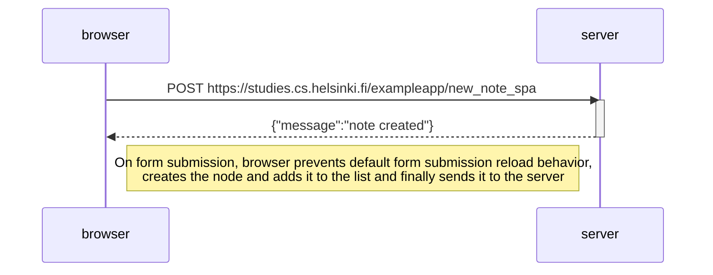

```mermaid
sequenceDiagram
    participant browser
    participant server

    browser->>server: POST https://studies.cs.helsinki.fi/exampleapp/new_note_spa
    activate server
    server-->>browser: {"message":"note created"}
    deactivate server
    note right of browser: On form submission, browser prevents default form submission reload behavior, <br/> creates the node and adds it to the list and finally sends it to the server
```
